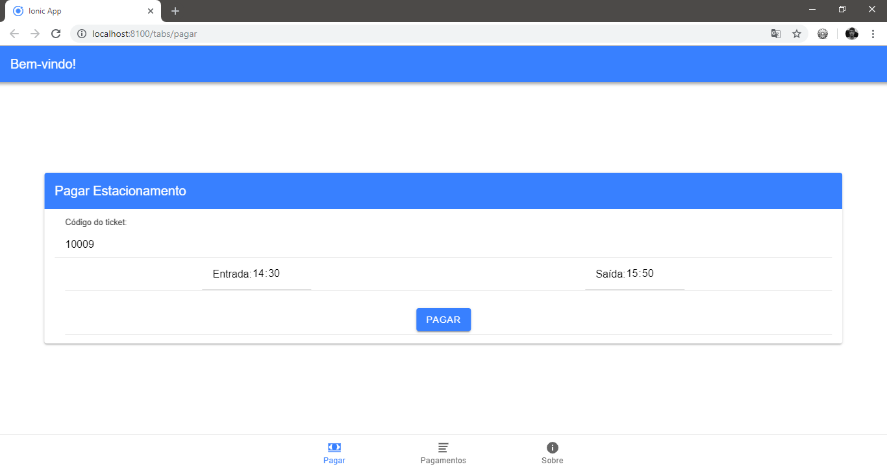
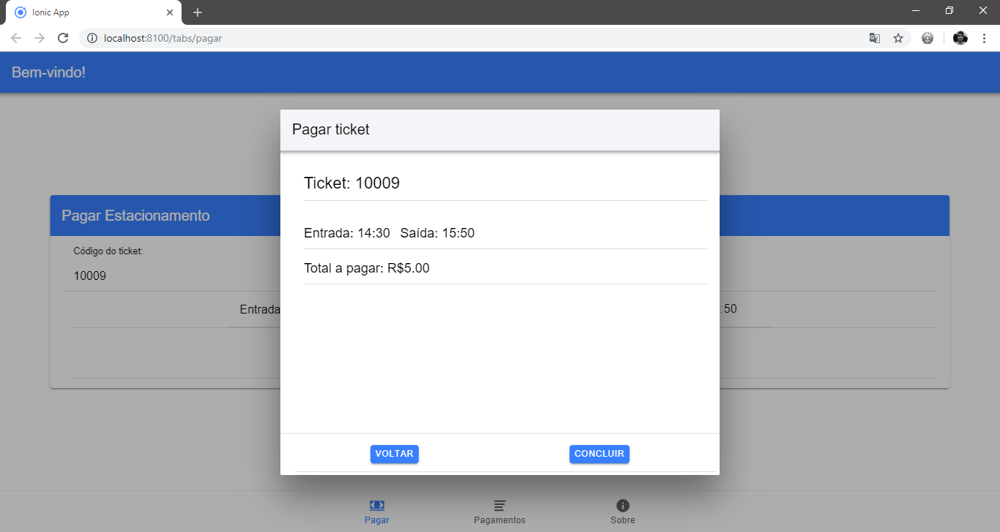
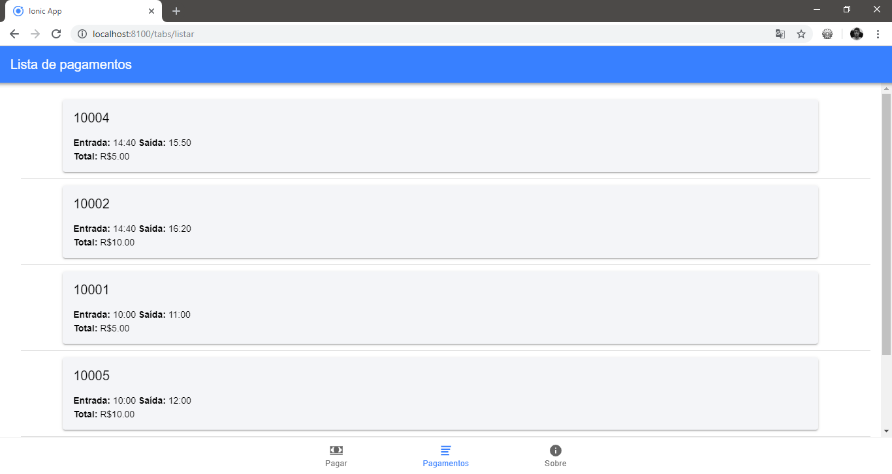

# Ionic e FireBase: Aplicação para estacionamento

  Projeto solicitado na disciplina de Programação para Dispositivos Móveis(7º Período) pelo professor Maurício, o qual deve possibilitar ao
usuário registrar pagamentos e listá-los através do FireBase.

#### Capturas de tela:

#### Pacotes Utilizados:

**Angular:**

Angular CLI: 7.3.5

Node: 10.15.1

OS: win32 x64

Angular:
...

**Package --------------------- Version**

@angular-devkit/architect --- 0.13.5

@angular-devkit/core -------- 7.3.5

@angular-devkit/schematics - 7.3.5

@schematics/angular --------- 7.3.5

@schematics/update --------- 0.13.5

rxjs ----------------------------- 6.3.3

typescript ---------------------- 3.2.4

----------------------------------------------

**Ionic:**

Ionic 4.12.0
